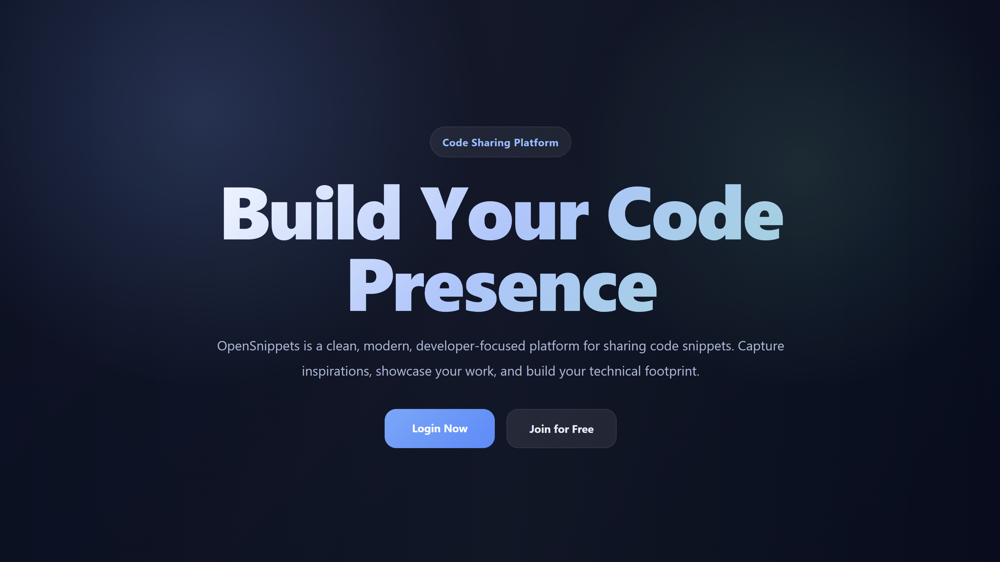
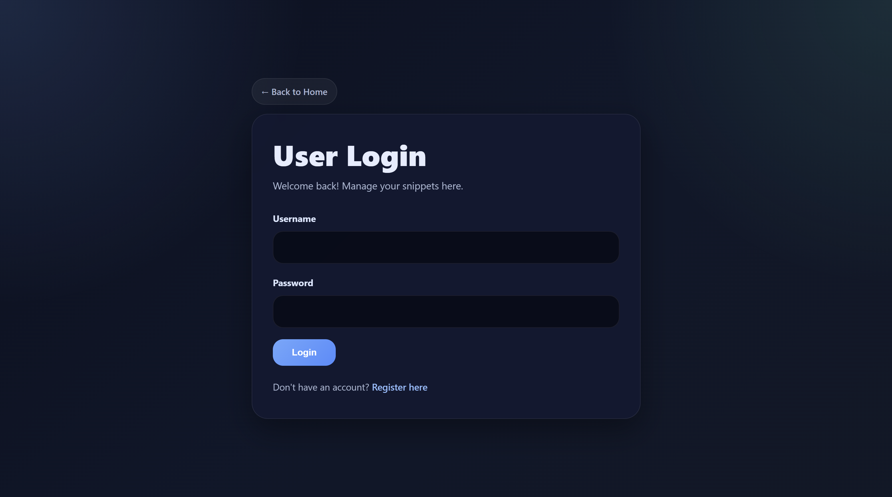
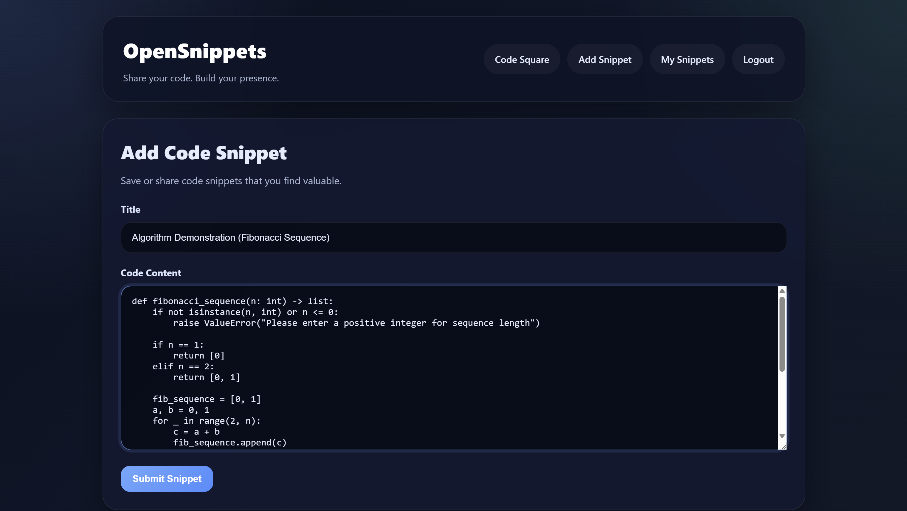
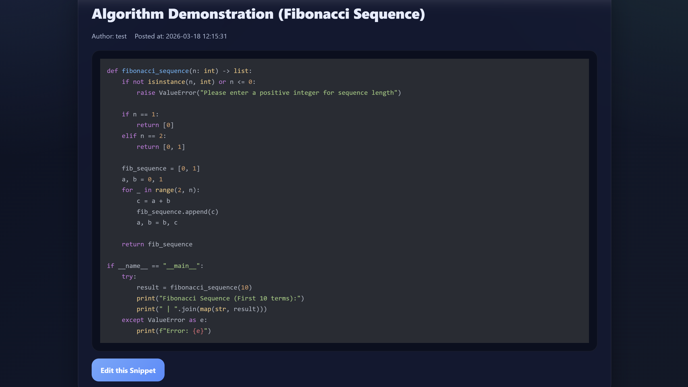

# OpenSnippets 🚀

A lightweight, developer-focused code snippet sharing platform built with Flask.  
👉 Designed for developers to quickly store, manage, and showcase reusable code snippets.

---

## 💡 What This Project Demonstrates

This project is not just a demo — it shows real backend development skills:

- 🔐 **User Authentication** | Register, Login, Logout system.
- 🧱 **Modular Architecture** | Clean Flask structure using Blueprints.
- 📝 **Full CRUD** | Create, Read, Update, and Delete code snippets.
- 🔎 **Search Engine** | Real-time search for titles and content.
- 🎨 **Syntax Highlighting** | Powered by `highlight.js`.
- 🔒 **Security First** | Password hashing with `bcrypt` & session-based auth.

---

## 📸 Demo Preview

### 🏠 Home Page
Discover all shared snippets at a glance.


---

### 🔐 Login Page
Secure access to your personal code collection.


---

### ➕ Add Snippet
Easy-to-use interface for adding new code snippets.


---

### 📄 Snippet Detail
Full view of code snippets with syntax highlighting.


---

## 🌐 Live Demo

👉 [https://your-project-name.onrender.com](https://your-project-name.onrender.com)

---

## 🛠️ Tech Stack

- **Backend**: Flask (Blueprint-based architecture)
- **Database**: SQLite (Raw SQL with modular model layer)
- **Auth**: `bcrypt` + Session
- **Frontend**: Jinja2 + CSS + `highlight.js`

---

## 📂 Project Structure

```text
open-snippets/
├── app.py              # App entry point & DB init
├── auth/               # User Authentication module
├── main/               # Main site routes
├── models/             # Database & SQL layer
├── screenshots/        # Project documentation images
├── snippets/           # Snippet Management logic
├── static/             # CSS & static assets
├── templates/          # Jinja2 HTML templates
├── requirements.txt    # Project dependencies
├── .gitignore          # Git ignore file
└── README.md           # Documentation
```

---

## 🚀 Getting Started

### 1. Clone the project
```bash
git clone https://github.com/ByteTechno/open-snippets.git
cd open-snippets
```

### 2. Create virtual environment
```bash
python -m venv venv

# Windows
.\venv\Scripts\activate

# Mac/Linux
source venv/bin/activate
```

### 3. Install dependencies
```bash
pip install -r requirements.txt
```

### 4. Run the app
```bash
python app.py
```

---

## 🧠 Design Philosophy

This project focuses on **Simplicity over Complexity**.

- **Clean Code**: Easy to read and maintain.
- **Modular**: Each feature lives in its own space.
- **Secure**: Basic security best practices are baked in.

---

*Made with ❤️ for the developer community.*
